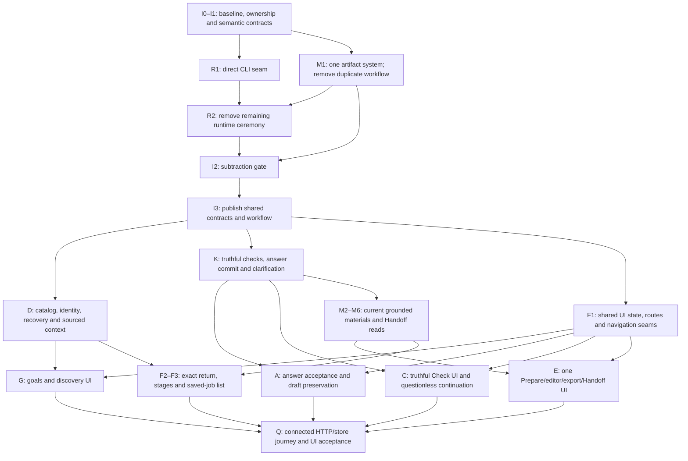

# Implementation tasks and concurrent lanes

26 September 2026 · Based on the [current-code review](current-code-wishes-review-2026-09-26.md) of `ef463c48035f392848c676eea06d6f4e30751307`.

**This turn produces an implementation plan. It does not start implementation.** Every task below is pending. The [owner's product definition](product-vision.md) and [UI/usability acceptance criteria](connected-prototype-ux-acceptance.md) govern the result. This is the next implementation handoff; the [earlier task list](connected-prototype-ux-parity-tasks.md) is historical baseline planning and should not be executed as another complete backlog.

## Required result

The owner saves explicit wants/don't-wants in ordinary forms; Contributor discovers public vacancies freely; Jev classifies them into five groups; the owner selects jobs; Contributor checks only chosen/started vacancies; Jev suggests editable approved answers; Standard prepares the materials each verified route needs; a separate saved-job/artifact list leads to manual Handoff instructions.

Prepare, exact edits, explicit rewrite, exports and Handoff must use **the same current artifacts and versions**. A verified no-question application can proceed. Changed inputs invalidate affected readiness while preserving inspectable prior content. Passive reads make no model call or workflow write. The app never fills an employer website, attaches files there, sends email or submits an application. The owner performs those external steps.

Match the prototype's task grouping, information priority, controls, navigation and usability. Colors, fonts, borders, corner radii, shadows and exact pixel spacing are outside this work. Retain working forms, selection, source evidence, Jev results, exact editors, version storage, minimal auth/CSRF and manual-only boundary.

## Implementation order

**Map and agree contracts → finish subtraction/consolidation → repair discovery/check/answer prerequisites and shared UI seams → complete grounded preparation and feature UI → connect saved Handoff → prove the full journey.**

The remaining cleanup is **R30 plus R08's duplicate preparation workflow**, not a repeat of already removed delivery/reply/interview/offer systems. Do not build new features against runtime or preparation paths scheduled for removal.

Use **one coordinator/integrator plus at most three implementation bots at once**. A lane is an ownership boundary, not a request to start every listed bot simultaneously. Queue lanes according to the schedule and explicit dependencies below. Inside a wave, start a task as soon as its prerequisites are integrated; only the contract and subtraction gates are global barriers.

### Dependency outline

## Lane ownership

Exactly one lane writes a file. Workers propose shared-file changes to its owner. Before handing a file to another lane, record the handover and ensure the first writer has stopped editing it.

| Lane | Bot responsibility | Exclusive write surface | Shared dependencies supplied by other lanes |
| --- | --- | --- | --- |
| **I · Integration and contracts** | Coordinator owns shared API/schema/workflow integration and gates. | `packages/contracts/openapi.yaml`, generated Go/TS contracts, `httpapi/handler.go`, `cmd/server/main.go`, all SQL migrations, `store/role_workflow.go`, shared DTOs, root verification/toolchain configuration. | Workers supply handler/registration/schema proposals; F owns the handwritten frontend client. |
| **R · Direct CLI and subtraction** | Replace rejected orchestration with necessary direct process execution; remove dead runtime paths. | Contributor/Standard invocation adapters, `musewire/live.go`, `standard.go`, runner/factory/session/probe consumers and agreed obsolete package cuts. | I integrates server/handler/schema changes. After R2, R hands check/classification/drafting adapter consumers to D/K/M by exact file. |
| **D · Discovery backend** | Catalog lifecycle, vacancy identity, run recovery, card facts and owner-source reads. | Discovery/classification service files; `store/reasoncatalog.go`, `opportunities.go` and agreed discovery persistence/query files; discovery-specific HTTP handlers/tests. | R direct invocation seam; I schema/registrations; K owns check/answer files. |
| **K · Check and answer backend** | Checked evidence, zero-question routes, exact answer continuation, Jev candidates and owner clarifications. | Check adapter/service files; `store/jobcheck.go`, answer values/matches and clarification files; `jev/answer_match.go`; check/answer HTTP handlers/tests. | R invocation seam; I workflow/schema/contracts; M consumes the checked/accepted inputs. |
| **M · Materials backend and consolidation** | One current artifact system, evidence freshness, grounded preparation/rewrite, replay/export and saved Handoff projection. | `store/artifacts.go`, `artifact_readiness.go`, material persistence files; `materialprep/*`; artifact/material/Handoff HTTP service files and necessary renderer/export adapters. | K accepted check/answer/clarification contracts; I workflow/schema/registrations; R Standard invocation. |
| **F · Shared frontend and navigation** | Shared reads/invalidation, client adapters, routes/stages, Search/Today/Jobs/Job detail/Applications and saved-job index. | `App.tsx`, `api/client.ts`, `pages/useRead.tsx`, `routes/useRoute.tsx`, shared navigation/stage components, `role-stages.tsx`, `application-continue.tsx`, Search/Today/Jobs/JobDetail/Applications pages and their integration tests. | I generated contracts; D/K/M reads and writes; G/C/A/E consume fixed props/hooks/callbacks. |
| **G · Goals and discovery UI** | Task-first opening panels, source experience, goal editor, results/cards/choice/action area and run controls. | `features/goals/*`, `features/owner-context/*`, `features/discovery/*` and focused tests. | F shared owner context, editor/navigation/invalidation seams; D card/source/run contracts; K check eligibility. |
| **C · Check UI** | Truthful saved findings, eligible explicit checks and route-aware continuation. | `features/check/*` and focused tests. | K route/completeness/continuation contracts; F shared reads, readiness, stages and navigation seams. |
| **A · Answers UI** | Exact acceptance of suggestions/blanks, retained drafts and commit-before-continue. | `features/answers/*` and focused tests. | K continuation and matching contracts; F navigation/draft-state/invalidation seams. |
| **E · Prepare and Handoff UI** | One preparation action, canonical editors/rewrite/export, visible partial work and per-job manual Handoff. | `features/prepare/*`, `features/handoff/*` and focused tests. | M canonical artifacts/exports; K clarification state; F routing/stages/list/client methods. M1's deletion of obsolete Prepare controls precedes exclusive handover of these files to E. |
| **Q · Connected acceptance** | Regression harness, real HTTP/store journey, browser/keyboard checks and closure evidence. | Agreed connected-test/harness/evidence files and updated smoke gates. | Test ownership is recorded before dispatch; Q requests changes in lane-owned component/package tests through that lane. |

`api/client.ts` is always F-owned; generated types are always I-owned. `handler.go`, `main.go`, workflow definitions and migrations are always I-owned. R/D/K/M must not independently edit these shared files. Shared R files such as `musewire/service.go` are assigned during I0; ownership transfers before discovery or check edits begin. F-owned shared context hooks are explicitly excluded from G's component ownership in that ledger.

## Phase 0 — Short contract and ownership gate

| Task | Required work | Depends on | Acceptance evidence |
| --- | --- | --- | --- |
| **[ ] I0 · Confirm the actual baseline** | Compare current HEAD/worktree with the reviewed commit; retain valid intervening fixes. Map exact remaining runtime and duplicate-pack consumers, endpoint/schema/test references, exports and file owners. Use the existing review and retain/cut ledger; do not repeat a full code audit. | None | A small checked retain/cut/shared ledger, actual file ownership and changed-baseline notes. Completed contact/lifecycle removal is recorded as retained, not queued for rebuilding. |
| **[ ] I1 · Freeze the minimum cross-layer semantics** | Record the contracts listed below with DTO/request/error/read shapes and ownership. Resolve necessary difficult choices under repository consultation rules. Define failing connected regression cases at the real HTTP/provider boundary. | I0 | D/K/M/F can implement against the same identities, states, version pins and write semantics; every shared contract has one writer. No vague “fix later” boundary between Answers and Prepare or Prepare and Handoff. |

### Contracts I1 must settle before parallel implementation

1. **Run identity and recovery:** server lookup for relevant active/paused/stopped/failed/completed/empty work and stable run deep links; localStorage is optional convenience.
2. **Brief/catalog lifecycle:** the saved explicit goal version governs one authored reusable rubric/reason catalog. Authoring occurs as part of an explicit search commission, never a passive read or ordinary form save. Failed authoring/classification is resumable without discarding captured jobs.
3. **Checked application shape:** verified questionless versus unresolved questions; truthful capture completeness; explicit required/optional/not-required/unknown documents; actual text fields versus attachments; verified route and field/upload mapping; selection/recheck eligibility.
4. **Answer continuation:** exact keep/edit/clear/blank choices, current job/check/question identities, expected saved versions and an idempotent stage commit. Required blanks may request grounded Standard drafting or a necessary personal fact. Zero-question continuation has an empty answer set and zero Jev calls.
5. **Owner clarification:** distinct identity/origin/evidence from employer questions, a saved verified owner answer, and resumption of only dependent work.
6. **One current artifact set:** Prepare/edit/rewrite/export/Handoff consume the same artifact identities and current versions. A pack may be a derived export of this set; it cannot have another independent drafting/readiness history.
7. **Evidence freshness and recovery:** actual consumed check/vacancy/source/profile/fact/answer versions; ready/held/outdated reasons; retained previous content; request digests/keys and accepted-write lookup for lost acknowledgments.
8. **Manual Handoff:** replace reviewing/sent semantics with durable saved Handoff and per-item ready/held/outdated status. Opening a page is GET-only; a link/copy/download never means applied. Partial sets remain listed. Saved work may be revisited for edits or dependent preparation.
9. **Shared frontend seams:** one saved-goal context, scoped invalidation after accepted writes, explicit run/job navigation, goal-editor open/focus callback and answer-draft preservation across navigation/rematching.

These fix required semantics. Exact storage/runner design remains bounded implementation work. For a **difficult** decision—runtime retrieval without rejected servers, canonical version organization, ambiguous duplicate identity, personal-claim grounding, candidate recall/batching or blank/clarification semantics—supply full code/evidence/constraints to Jev SystemOne, perform the repository's three fully rewritten semantically equivalent consultations, save requests/responses and investigate disagreements. Agreement is advice; tests/source evidence establish acceptance. Do not perform paid consultations during this planning turn or repeatedly consult settled facts.

## Phase 1 — Finish subtraction and consolidate before new feature work

| Task | Required work and issue mapping | Depends on | Acceptance evidence |
| --- | --- | --- | --- |
| **[ ] R1 · Establish the direct CLI seam** | Retain only direct Contributor/Standard process invocation, bounded timeout/cancel, structured output/error handling and durable operation identity. Establish how freely chosen public retrieval produces saved verifiable evidence without per-run MCP/session servers. Preserve source freedom and manual-only behavior. **R30.** | I1 | A local zero-spend process/structured-output proof plus documented evidence/save boundary. Missing CLI/access is an honest blocker; no fabricated lane proof. Discovery/check/drafting have one interface to bind to. |
| **[ ] M1 · Remove the second preparation workflow** | Trace existing packs/artifacts and make one route artifact set the authoritative user content. Remove independent combined-pack prepare/edit/rewrite/readiness controls, endpoints and stores/tests when no longer needed. Retain necessary source loading/rendering only as consumers or derived exports of the same current artifacts. Hand Prepare/Handoff files to E after the cut. **R08; empty old editor.** | I1 | No second draft/rewrite/version truth remains. Existing current artifact reads/exact saves compile and remain inspectable. No legacy fallback or compatibility path. |
| **[ ] R2 · Cut rejected runtime consumers** | Remove custom session/lane verification, supervisors/transports and per-run MCP servers, old Codex connect/MCP endpoints and dead alternate commissioning paths after R1/M1 consumer trace. I integrates wiring/contracts/schema/test/doc cleanup. Keep only needed persistence, public evidence, Jev, bounded direct invocation and auth. **R30.** | R1, M1 | Normal server wires the intended direct paths; cut registrations/packages have no remaining consumers. Passive reads/boot start no provider work; no employer-action path reappears. |
| **[ ] I2 · Pass the subtraction gate** | Compile retained paths, verify route/schema/contracts and focused negative contact checks, inspect actual cuts and remaining named consumers. Report measured removals, without a percentage target. Repair verification commands/toolchain so the documented checks run consistently. | M1, R2 | All retained code/contracts compile; schema initializes fresh; obsolete runtime/dual-preparation paths are absent. No new feature lane starts before this gate. |
| **[ ] I3 · Publish the implementation contracts** | Land/regenerate the I1 contract shapes and minimal workflow/schema changes, including true Handoff state. Publish stable shared interfaces for each lane and coordinate registration/server changes. | I2 | One contract source; generated output matches it; consumers can compile against the declared versioned semantics. I owns later coherent extensions. |

R1 and M1 can run concurrently. R2 removes consumers only after their replacements or retained consumers are established. A CLI wrapper or derived PDF exporter is not a reason to preserve the rejected session or duplicate pack workflow.

## Lane D — Fresh discovery, identity and server recovery

| Task | Required work | Depends on | Acceptance evidence |
| --- | --- | --- | --- |
| **[ ] D1 · Author/reuse a catalog on the production path** | Explicit Find jobs ensures a catalog for the current saved goal version, preserving wants/don't-wants, conflicts and missing-information choices. Reuse it across listings/passes; concurrent/retried commission converges on one accepted version. Persist authoring/classification failures and collected evidence. **R01.** | I3, R1 | Fresh DB with no seeded catalog: first explicit commission authors it and classifies; a second run reuses it; changed goals obtain a new catalog once. Opening results/reasons/goals calls no model. |
| **[ ] D2 · Preserve vacancy identity and useful card facts** | Reconcile a verified source identity before creating company/opportunity rows; save source sightings/updates to the same job when justified. Preserve choice/check/artifact links across Find more. Do not merge merely because title/company resemble another job. Carry evidence-grounded employer/work arrangement through collection/store/read projections; missing values stay unknown. Expose support availability honestly. **R12, R25, R28.** | I3, R1 | Recollect the same verified vacancy across passes: one job identity and saved choice/material links. A genuinely different vacancy stays distinct. Employer/remote facts survive API reads; absent support is not zero. |
| **[ ] D3 · Recover runs from the server** | Add relevant/latest/history reads and stable run lookup for active and terminal states. Stop/resume preserves saved cursor/evidence; retries use durable identity. Read/resume old work without starting a new discovery pass. **R13.** | I3, D1, D2 | A second browser context recovers the same running/paused/stopped/failed/completed/empty run. Resume continues it; Find more explicitly creates a new deduplicated pass. |
| **[ ] D4 · Expose sourced owner context** | Read approved CV/source experience and provenance separately from the reusable answer library; expose owner identity where supported. Use existing source loading. Any required summary extraction happens once at explicit source ingestion/update, with source references, not on panel reads. **R16; sidebar identity.** | I3, R2 | Existing career sources produce readable past experience with source links even with zero reusable answers. The owner does not retype known facts; no passive model call. |

## Lane K — Checked route, exact answer commit and personal facts

| Task | Required work | Depends on | Acceptance evidence |
| --- | --- | --- | --- |
| **[ ] K1 · Make selected checks truthful and route-complete** | Admit only selected, explicitly started eligible checks. Validate usable performer before leaving a job checking; report unavailable/unsupported honestly. Preserve verified route/documents/requirements when held. Derive completeness/gaps from actual capture metadata. Support verified zero questions separately from inaccessible/unresolved questions; save requiredness and actual field/attachment mapping. Define separate explicit recheck eligibility. **R06, R19, R20; R09/R24 inputs.** | I3, R1 | Unselected starts rejected; unavailable performer never leaves inert checking. A verified questionless email/upload vacancy completes and proceeds. Incomplete captures remain incomplete; unresolved questions stay held with retained findings. |
| **[ ] K2 · Give Jev relevant approved candidates** | Remove lexical-only exclusion/top-eight truncation that hides semantically relevant answers. Use supported Jev choices over appropriately scoped approved versions, with coverage-preserving bounded batches when needed and explicit no-fit. Save match/reason evidence and reuse reads; no LLM match or explanation pass. **R29.** | I3, K1 | A relevant approved answer with different wording/sparse tags reaches Jev; all returned choices refer to approved current versions or no-fit. Large libraries stay bounded without silently dropping relevant candidates. |
| **[ ] K3 · Commit every accepted answer choice** | Implement exact saved keep/edit/clear/blank semantics and idempotent continuation against the current job/check/question set. Do not require nonblank text for every required question before allowing grounded drafting. Persist choices first; transition only against their accepted versions. A zero-question route commits an empty set without invented boxes or Jev calls. **R03, R04 backend.** | I3, K1, K2 | Untouched suggestion, edited answer, optional blank and required draft request survive reads and allow preparation. Stale/cross-job/concurrent writes conflict without false advancement. Failed/partial saves do not advance. |
| **[ ] K4 · Save a distinct owner clarification and resume basis** | Model/store/API for a genuinely unknown personal fact tied to a sourced vacancy requirement and affected work. Separate it from employer questions; save the owner's exact answer and expose it as verified job-scoped context. New text is not silently library-approved. **R21.** | I3, K1, K3 | One saved answer resolves the same clarification once; another job/item remains usable. API supplies dependency identity so M resumes only affected work. |

## Lane M — Current grounded materials, versions and Handoff basis

M1 belongs to the subtraction phase. M2–M6 complete the surviving artifact system after checked/answer contracts are integrated.

| Task | Required work | Depends on | Acceptance evidence |
| --- | --- | --- | --- |
| **[ ] M2 · Pin evidence and reconcile accepted writes** | Persist the consumed check/vacancy/source/profile/fact/answer identities/versions in generated artifact basis. Compare them before generation and commit; invalidate affected readiness on changes, retain full prior content and reuse unaffected work only when dependencies justify it. Bind request keys to payload/basis/pin digests; identical replay resolves accepted work and changed replay conflicts. Require selected-job state for writes. **R07, R23 backend.** | M1, I3, K1, K3 | Changed answer/recheck/source fact makes affected material held/outdated, never silently ready. A concurrent input change cannot commit a fresh-looking stale draft. Lost response can locate the accepted version; changed payload cannot replay as success. |
| **[ ] M3 · Derive the actual route-needed targets** | Consume explicit document/field requiredness. Preserve optionality, negation and unknowns; distinguish attachment upload instructions from pasteable text values. Derive CV/email/letter/form needs from the verified route, not a universal artifact checklist or keyword presence alone. **R09.** | M2, K1 | Optional CV stays optional; “letter not required” does not demand one; upload questions are not text answers. Email and portal routes produce their different justified target sets. |
| **[ ] M4 · Prepare once with complete vacancy context and grounded facts** | One explicit Prepare operation produces the required current set, including unanswered required text only from verified owner facts. Include full relevant vacancy description/requirements, route, actual fields, approved facts and accepted answers. Validate personal-claim support against supplied evidence; valid IDs alone are insufficient. Use deterministic validation for known facts and Jev supported primitives where semantic assessment is needed. Neutral subject/greeting without a personal claim may legitimately need no owner-fact reference. Preserve partial work and ask a focused K4 clarification when a necessary fact is unknown; resume only dependent items. Journal real activity/output/error/held states. **R08, R10, R11, R21.** | M2, M3, K3, K4, R1 | Required vacancy context reaches Standard. Deliberate unsupported personal claims are rejected/held even with valid/absent IDs; supported tailored prose and neutral subject work. Optional fields may stay blank. Missing fact causes no invented claim, saves partial work and resumes only its dependencies. |
| **[ ] M5 · Edit and rewrite the same artifacts** | Exact edits preserve literal owner text as an honestly attributed new version with zero model calls. Explicit Standard rewrite targets chosen current items, uses the same grounded basis and creates inspectable versions. Unrelated jobs/items remain unchanged. Freshness/replay rules apply to both paths; direct edits do not silently become approved reusable facts. **R08, R23.** | M2, M4 | Exact edit and targeted rewrite update the same identity later displayed by Prepare/Handoff/export; previous versions remain readable. Same-key lost-response recovery avoids duplicate work or false conflict. |
| **[ ] M6 · Export and index the canonical saved set** | Render useful CV/letter downloads from the actual current artifact content; email/fields remain copyable text. Preserve artifact identity/version/checksum in exports. Provide a durable job/artifact index and true manual Handoff state, including ready/held/outdated items, saved destination/field mapping and prior content reads even with blocked/outdated checks. I integrates terminal transitions and registrations; passive page reads perform no transition. **R17, R18, R22.** | M3, M4, M5, I3 | Display/edit/rewrite/download/Handoff agree on content/version. Saved-job index shows item types/versions/status and resolves correct routes. Partial/stale saved text remains readable; opening/copying/exporting never means applied. |

Classifier agreement/confidence does not certify truth. M4's evidence validation, saved provenance and owner-readable review remain acceptance requirements; do not add another generative writing pass just to explain the validation.

## Lane F — Shared frontend state, routes and saved-job navigation

| Task | Required work | Depends on | Acceptance evidence |
| --- | --- | --- | --- |
| **[ ] F1 · Publish shared state/navigation seams** | One saved-goal context for Search and discovery; scoped invalidation after accepted goals/selection/check/answers/material writes; stable run/job deep links and server-backed restoration; editor-open/focus callback; retained answer-draft navigation seam. Update handwritten client once per integrated contract. Avoid blind global polling/recommissioning. **R02, R13, R14 prerequisites.** | I3 | G/C/A/E have stable hooks/props/methods; an accepted write updates the relevant projections immediately. Internal navigation and passive refresh perform no provider work. |
| **[ ] F2 · Make opening/status/progress match actual work** | Default saved-before-run root to My search; honor explicit deep links and active saved work. Put sourced experience/wants before the primary commission, with administration secondary. Derive stages from actual goals/run/selection/job/Handoff state and include Contributor + Jev actors where appropriate. Keep sidebar/status/Applications visibility current; show supported owner identity. **R14, R15, R17; first-use gaps.** | F1, D3, D4, K1 | Save/select/start/stop/return changes the strip/nav/stage without reload. Ready never contradicts missing goals or runtime blockers. Running discovery shows Find jobs; results show Select jobs; actual Handoff shows step 7. Main action occupies the intended task-first hierarchy. |
| **[ ] F3 · Connect the saved-artifact job list** | Add the separate saved-job/material index; fix Today/Applications/Prepare continuation and Handoff links to the actual per-job Handoff route. Show item types/current versions/status/full-item links instead of an opaque pack history. Keep partial work findable and isolated. **R18, R22 navigation.** | F1, F2, M6 | New session/deep link opens the same saved job/items, not Prepare again or an unrelated pack. Handoff active state is correct; passive navigation commissions nothing. |

## Lane G — Goals, discovery and selection usability

| Task | Required work | Depends on | Acceptance evidence |
| --- | --- | --- | --- |
| **[ ] G1 · Make goals/source context coherent** | Consume F's shared saved context. Immediate save readback updates Find jobs; dirty unsaved goals are not silently ignored by navigation/search. Use D4 CV/source facts and links for Your experience. Keep known facts separate from future choices. Show salary in ordinary currency units, converting exactly at the API boundary. **R02, R16; salary gap.** | F1, D4 | First want save immediately enables the correct readiness. CV context appears without reusable answers; owner does not transcribe known facts. Salary round-trip matches entered units. |
| **[ ] G2 · Restore task-first commission and actual run controls** | Put Find jobs/Change goals after the contexts; move technical brief/profile/readiness details into secondary disclosure. Change goals opens/focuses the deterministic editor. Apply real state-valid Start/Stop/Resume/Find more controls; completion leads to Select jobs. Offer Edit goals/Find more beside results while preserving earlier work. **R15, R26.** | F1, F2, D1, D3 | Main action is reachable at comparable opening content; Change goals works. Every run state has valid actions and saved-state wording. New pass is explicit and deduplicated; reading results/reasons starts no work. |
| **[ ] G3 · Show useful jobs and consistent choice** | Lead cards with employer/title/evidence-grounded arrangement, principal saved reason and material conflict/unknown. Use the consistent checkbox-style selection; choosing a conflicting job does not relax standing goals. Preserve cross-group decisions and honest absent support display. **R25, R26, R28.** | F1, D2, K1 | Essential comparison facts are visible without opening evidence; choices survive switching groups/reload. Why uses saved reasons/evidence and zero new model calls. |
| **[ ] G4 · Keep selection and tabs usable** | Compact reachable count/action area with View selection/current work; bulk Check includes only fresh eligible choices. Put chosen-role detail outside the sticky action area; explicit recheck is separate. Implement proper tab/panel IDs, roving focus/arrow keys and visible focus. **R24, R27.** | G3, F1, K1 | Many chosen jobs do not cover a narrow viewport. Zero eligible choices disables bulk Check; existing preparing/Handoff jobs remain accessible. Keyboard and screen-reader relationships match the tab controls. |

## Lane C — Check findings and route-aware continuation

| Task | Required work | Depends on | Acceptance evidence |
| --- | --- | --- | --- |
| **[ ] C1 · Show truthful findings and continue the checked route** | Preserve the working Check page while consuming K's corrected completeness, gaps, required/optional documents, actual text/upload fields and route. Keep verified findings visible when held; expose only eligible explicit start/recheck and honest unavailable states. A verified zero-question route offers an explicit continuation using K3's empty-set commit to the same Prepare task; an unresolved form remains held and actual questions lead to Answers. Reuse F's navigation/invalidation seam. **R06, R09, R19, R20; R22 check visibility.** | F1, K1, K3 | Questionless email/upload → explicit continuation → real committed workflow → same job Prepare. Unknown questions do not bypass the hold. Retained route/documents remain readable; reads/mounts never check, match, commit or prepare. |

## Lane A — Answer acceptance and retained drafts

| Task | Required work | Depends on | Acceptance evidence |
| --- | --- | --- | --- |
| **[ ] A1 · Separate displayed suggestions from saved choices** | Unsaved Jev text is a suggestion, not a saved baseline. Explicit continuation persists untouched kept suggestions, edited text, cleared boxes and appropriate blanks with exact provenance/version. Never accept suggestions on read/mount. **R04.** | F1, K2, K3 | Keep untouched suggestion → continue → same exact saved answer exists. A blank choice is explicit and survives reads; no library promotion or Answer-stage LLM. |
| **[ ] A2 · Preserve draft text and freeze continuation inputs** | Retain job/check/question-scoped dirty text across rematching and internal navigation; avoid loading unmount discarding boxes. Changed checks reconcile or hold old drafts honestly. During bulk continuation, freeze the captured input or block editor changes until completion. Keep text on failed/conflicted saves and reconcile accepted writes before retry. **R05.** | F1, A1, K3 | Type → rematch/navigation → return preserves text. Delayed save/partial failure/concurrent input change cannot lose newer edits or falsely advance. Another job/check cannot receive the draft. |
| **[ ] A3 · Save, commit, then continue** | Use K3's corrected commit after all accepted choices persist; verify acknowledged current job/check/workflow state, then navigate to the same Prepare task. Reuse the same continuation semantics as C1's questionless path. Step 6 starts only through its explicit Prepare action, never by page mounting. **R03 UI, R06 continuation.** | A1, A2, K1, K3 | Full Answers UI → actual backend → preparation is accepted, without seeding answered state. Required draft request is allowed; failed commit stays on preserved answers. |

## Lane E — One preparation/editor/export/Handoff experience

| Task | Required work | Depends on | Acceptance evidence |
| --- | --- | --- | --- |
| **[ ] E1 · One Prepare action and real work disclosure** | Consume M's sole artifact set and operation journal. Replace dual Prepare application/Draft held artifacts with one coherent explicit operation. Show target items, facts/answers used, real activity, errors and ready/held/outdated reasons; show focused owner clarification and dependent resume. **R08, R10, R21.** | F1, A3, M4 | One action prepares the route-needed set; another ready job/item stays usable while a fact is held. No model call from read/reload/editor opening. |
| **[ ] E2 · Canonical prefilled editors and targeted rewrite** | Open exact editors on current artifact/form text. Exact save is literal and makes zero model calls. A separate explicit rewrite changes selected canonical items with new inspectable versions. Use stable request identity/readback on uncertain acknowledgments. Remove obsolete empty pack editor rather than polishing it. **R08, R23; old-editor gap.** | E1, M5, F1 | Edit/rewrite results agree with Handoff and downloads; unchanged items/jobs stay intact. Lost response recovers accepted text/version before another operation. |
| **[ ] E3 · Keep partial/stale work readable and exportable** | Render per-field saved form values even when another is missing. Keep previous artifacts readable under blocked/outdated checks with honest status. Copy/download the version shown; useful CV/letter files use canonical content. **R07 UI, R22; export gap.** | E1, E2, M2, M6 | One held field does not hide ready text. Changed inputs cannot display stale content as ready. Displayed/exported version/content match, with clear job/item/version filenames. |
| **[ ] E4 · Finish manual per-job Handoff** | Correct per-job destination/full-item routes and task orientation. Show verified website/email and which real values/files the owner should paste/upload/attach, with unknowns explicit. Preserve partial/stale list visibility. No fill/attach/send/submit control/API/browser automation. **R17, R18, R22.** | E2, E3, F3, M6 | Saved index/Today/Applications/Prepare all open the correct Handoff. Owner can inspect/take out each current item and follow source-backed steps personally. Opening links or copying never claims submission. |

## Concurrent dispatch schedule

The coordinator I remains active throughout. The three columns below are the **maximum worker slots**, not rigid assignments to people/models. Hand over exact files before a worker changes lane.

| Wave | Worker slot 1 | Worker slot 2 | Worker slot 3 | Exit condition |
| --- | --- | --- | --- | --- |
| **0 · Map/contracts** | R consumer/capability evidence for I1 | M duplicate-artifact consumer evidence for I1 | Q connected regression cases and test ownership | I0/I1 complete; no feature implementation yet. |
| **1 · Subtract/consolidate** | R1, then R2 | M1, then proposed I schema/contract cuts | Q0 connected harness plus verification setup at agreed boundaries | I2 passes, then I3 contracts land. |
| **2 · Prerequisites/shared seams** | D1–D4 | K1–K4 | F1, then F2 parts whose backend dependencies have landed | Fresh discovery/check/continuation backend contracts and shared UI seams integrated. |
| **3 · Core corrections** | M2–M6 in dependency order | C1, then A1–A3 | G1–G4; F2 completion uses this slot when its files/dependencies require it | Connected discovery/selection/check/answer path works; one canonical preparation backend available. |
| **4 · Connect the finish** | E1–E4 | F2/F3 remaining status/list/navigation | Extend Q0 cases as ready; run full Q1 only after all its dependencies land | Q1 passes: Prepare/edit/rewrite/export/Handoff refer to the same current set; no disconnected screen double pass. |
| **5 · Acceptance** | Q2 desktop/narrow/keyboard | Q3 configured live-provider evidence | Original lane owner fixes demonstrated residual failure, if any | Q4 closure ledger complete. |

If M/E or D/G prerequisites are still pending, move a ready task into a free slot. Do not start a dependent task against a guessed interface, or exceed three workers plus coordinator. No concurrent writes to shared files; I/F owners integrate proposals sequentially.

**Critical dependencies:** I0/I1 → R1 + M1 → R2/I2 → I3 → K1/K3 → C1/A1–A3 and M2–M6 → E1–E4/F3 → Q1–Q4. In parallel, I3 → D1–D4/F1 → G1–G4/F2 → Q1–Q4. M2's evidence pins precede every new writer; M3's true requiredness precedes target selection; M4's grounding rules precede accepting generated content.

## Lane Q — Acceptance gates that catch the reviewed failures

| Task | Required proof | Depends on |
| --- | --- | --- |
| **[ ] Q0 · Build the connected regression boundary** | Use the production HTTP router and real temporary store/schema. Replace only Contributor/Jev/Standard provider/process boundaries with controlled adapters. Start without a catalog, seeded answered stage or fabricated ready artifacts. Correct existing tests that encode the reviewed faulty behavior. Assign test file ownership. | I1; contract-specific cases update after I3 |
| **[ ] Q1 · Prove the same identities through all seven steps** | Save first/new-version goals → immediate correct readiness → once-per-version catalog → actual discovery persistence → deduplicated selection → selected check → keep/edit/blank → backend commit → one preparation → exact edit → targeted rewrite → canonical export → saved-job index/manual Handoff. Cover questionless email and portal/text/upload branches, owner-fact hold/resume, two-job isolation, changed-input invalidation, lost acknowledgment and second-session return. Verify reads/Why/exact edits make zero provider calls and no employer action is callable. | Q0, D1–D4, K1–K4, M2–M6, F1–F3, G1–G4, C1, A1–A3, E1–E4 |
| **[ ] Q2 · Prove UI and usability** | Compare opening grouping/order/action priority to the screenshot at comparable saved content, without grading styling or preview bar. Desktop/narrow/keyboard walkthrough includes goals edits, five groups, many chosen jobs, lifecycle controls, long/partial/stale materials, exact editors, saved-list/Handoff and errors. Validate correct active stages/status, accessible tabs and no viewport-covering action list. | Q1 |
| **[ ] Q3 · Record live product evidence** | With configured services and the implementation run's authorization, exercise real Contributor collection and chosen-only deep check, Jev classification/answer choice, Standard grounded route materials and manual Handoff inspection. Use saved source/material/version evidence. Record real route coverage and precise unavailable states; do not substitute scripted results for a live pass or contact the employer. | Q1; live UI walkthrough uses Q2 corrections |
| **[ ] Q4 · Close the finding/acceptance ledger** | Record each R finding/smaller gap and acceptance ID with its implemented task, checkpoint, meaningful test/source/UI/live evidence and remaining limit. Full retained suite/build/generated checks pass. Stop review once demonstrated failures are resolved and required gates pass; do not loop on optional reviews. | I2, Q1, Q2, Q3 |

The planning turn performs none of these executions. If a configured live provider/route is unavailable during implementation, report that exact live gate as pending; passing fixture/code checks cannot close it. A time or dollar budget is not completion evidence.

## Complete review-to-task mapping

| Review finding | Implementation tasks |
| --- | --- |
| R01 catalog authoring | D1, Q1 |
| R02 stale goals/discovery context | F1, G1 |
| R03 answer workflow commit/required blanks | I1, K3, A3 |
| R04 untouched suggestions not saved | K3, A1 |
| R05 lost dirty text | F1, A2 |
| R06 verified zero questions blocked | K1, K3, C1, A3, Q1 |
| R07 stale artifact readiness | M2, E3 |
| R08 separate pack/artifact systems | M1, M4, M5, E1, E2 |
| R09 wrong optionality/negation/attachments | K1, C1, M3 |
| R10 incomplete drafting context | M4, E1 |
| R11 unsupported claim acceptance | M4, Q1 |
| R12 duplicate vacancy identity | D2 |
| R13 browser-local recovery | D3, F1, F2 |
| R14 stale/false shell/nav state | F1, F2 |
| R15 buried commission/inert Change goals | F2, G2 |
| R16 unsourced experience panel | D4, G1 |
| R17 incorrect stages/no terminal Handoff | I3, F2, M6, E4 |
| R18 Handoff links/index incomplete | M6, F3, E4 |
| R19 inert checking without performer | K1, C1 |
| R20 overclaimed capture completeness | K1, C1 |
| R21 owner clarification missing | K4, M4, E1 |
| R22 partial/stale content hidden | C1, M6, F3, E3, E4 |
| R23 lost-response/replay defects | M2, M5, E2 |
| R24 ineligible/bulky selection action | K1, G4 |
| R25 employer/arrangement card facts | D2, G3 |
| R26 choice/run/results controls | G2, G3 |
| R27 tab keyboard relationships | G4, Q2 |
| R28 false numeric support display | D2, G3 |
| R29 lexical answer exclusion | K2 |
| R30 rejected runtime remains | R1, R2, I2 |
| Default Today, absent owner identity, Find/Jev label | D4, F2 |
| Salary asks for cents | G1 |
| Empty combined-pack editor | M1, E2; remove duplicate rather than separately polish it |
| Broken root typecheck/host toolchain verification | I2, Q4 |

## Worker dispatch and completion format

Give each bot the owner definition, this plan, its task IDs, dependencies already integrated, exact writable files and the current checkout. A suitable dispatch instruction is:

> Implement only the ready tasks in lane NAME. Preserve the seven-step owner definition and manual-only Handoff. Use existing functioning code and repair the mapped findings. Do not edit I/F/shared files; propose required changes to their owners. Do not add compatibility paths, fixed source lists, invented jobs/questions/facts or implicit provider work. Add/fix regression coverage for the actual reviewed failure at the connected boundary. Report completed IDs, exact changes, verification results, shared proposals, unresolved dependencies and evidence limits. Do not claim completion from isolated fixtures or code presence.

The coordinator integrates one coherent checkpoint at a time, updates dependencies and dispatches the next ready tasks. For each task, record **change + reason + meaningful verification + material limitation**. Existing passing tests remain useful; add coverage for the concrete failures rather than writing tests that mirror cosmetic implementation details.

**Completion means the desired UI/usability and same-job journey satisfy the gates, with honest live evidence. It does not mean every bot exhausted its allotted hours or every table row has an unchecked claim of “done.”**
